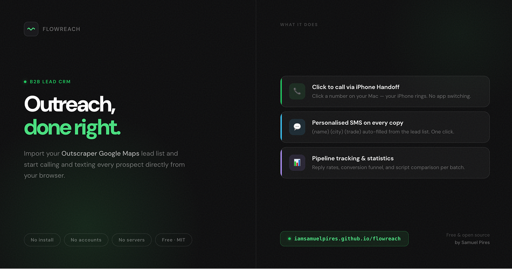
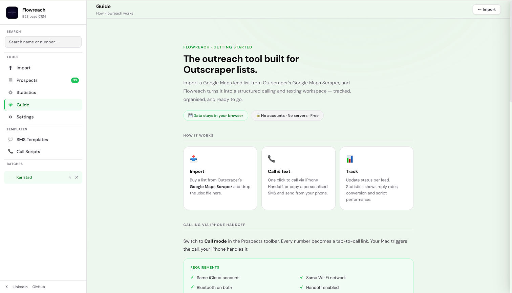
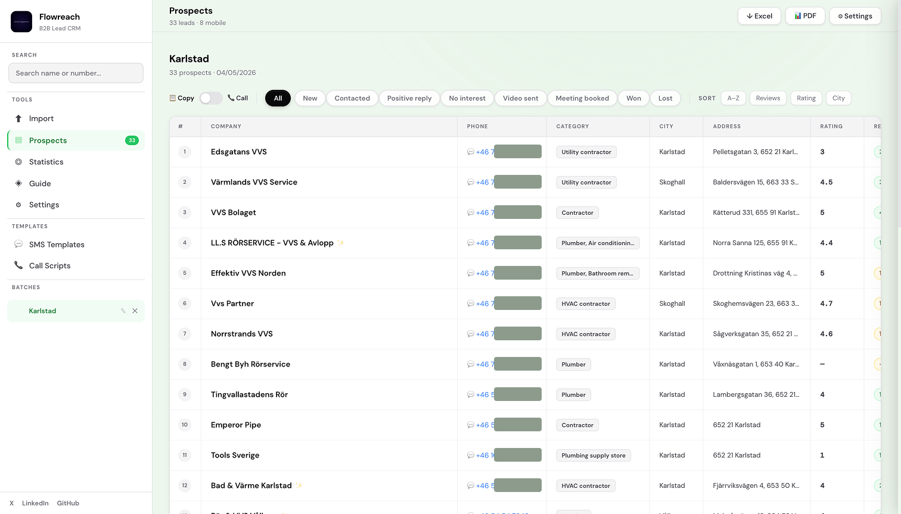
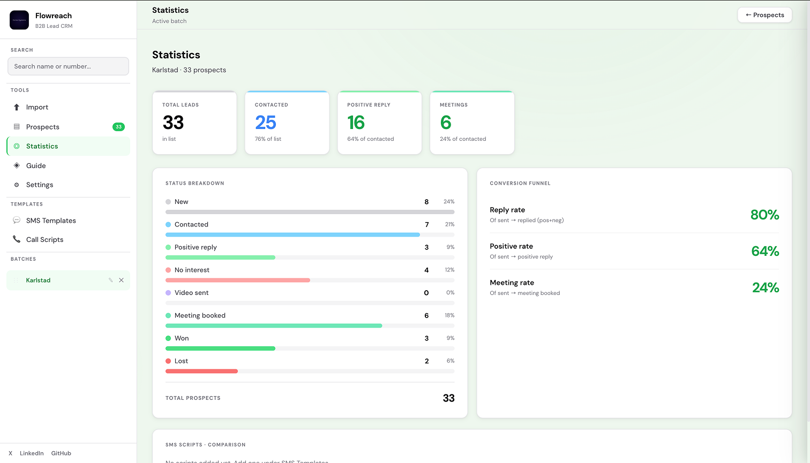

# Flowreach — B2B Lead CRM

[](./LICENSE)
[](#)
[](#)
[](#)

**[→ Open Flowreach in your browser](https://iamsamuelpires.github.io/FlowReach/flowreach.html)**

---



---

A structured calling and outreach CRM built for sales people who use [Outscraper's Google Maps Scraper](https://outscraper.com). Import a lead list, open it in your browser, and start calling and texting every business directly — tracked, organised, and logged in one place.

No installation. No accounts. No servers. No fees. Open the file and go.

---

## Who it's for

You're doing B2B outreach. You buy lead lists from Outscraper's Google Maps Scraper — plumbers, electricians, dentists, landscapers, any local business niche. You call or text them from your Mac using your iPhone. You need somewhere to track who you've reached, what they said, and what comes next.

That's Flowreach.

---

## Screenshots







---

## What it does

| Feature | Detail |
|---|---|
| **Import** | Drop any `.xlsx` export from Outscraper's Google Maps Scraper |
| **Call** | Click a number on your Mac → your iPhone rings (via Handoff) |
| **SMS** | Copy personalised messages with `(name)` `(city)` `(trade)` auto-filled |
| **Pipeline** | Track every lead: New → Contacted → Positive reply → Meeting → Won |
| **Timeline** | Every status change logged automatically with a timestamp |
| **Statistics** | Reply rates, conversion funnel, script comparison per batch |
| **Export** | Excel export or PDF batch report in one click |
| **Search** | Find any lead by name or phone number across all batches |
| **Privacy** | All data lives in your browser's `localStorage`. Nothing leaves your device. |

---

## Live demo

**[iamsamuelpires.github.io/FlowReach/flowreach.html](https://iamsamuelpires.github.io/FlowReach/flowreach.html)**

No sign-up. Click and use. Your data stays in your own browser.

---

## Getting started

### Option 1 — Use it online (recommended)

[Open the live link](https://iamsamuelpires.github.io/FlowReach/flowreach.html) and bookmark it. Done.

### Option 2 — Run it locally

1. Download [`flowreach.html`](./flowreach.html)
2. Open it in Chrome or Safari
3. Bookmark it — your data lives in that browser tab's storage

Either way: no terminal, no npm, no setup.

---

## How to get leads

Flowreach is built specifically for **Outscraper's Google Maps Scraper**.

1. Go to [outscraper.com](https://outscraper.com)
2. Search your niche and city — e.g. *"plumbers in Stockholm"* or *"dentists in London"*
3. Export the results as `.xlsx`
4. Drop the file into Flowreach → Import → name the batch → done

Rows without phone numbers are filtered out automatically.

---

## SMS templates

Write a message once. Send it personalised to every lead.

```
Hi (name), I noticed a lot of (trade) in (city) lose leads from missed calls. Is that ever a problem for you?
```

When you click **Copy** on a lead row, `(name)`, `(city)`, and `(trade)` are replaced with that lead's actual data from the Outscraper list. Paste it into Messages on your iPhone and send.

---

## Calling via iPhone Handoff

Switch to **Call mode** in the Prospects toolbar. Every phone number becomes a clickable link.

**Requirements:**
- iPhone and Mac signed into the same iCloud account
- Both on the same Wi-Fi
- Bluetooth enabled on both devices
- Handoff turned on: iPhone Settings → General → AirPlay & Handoff

Click a number on your Mac → your iPhone rings → pick up and talk.

---

## Pipeline stages

Default stages (fully customisable in Settings):

```
New  →  Contacted  →  Positive reply  →  No interest  →  Video sent  →  Meeting booked  →  Won  →  Lost
```

Add your own stages, rename them, assign colours, reorder. Filter chips in the Prospects view update automatically.

---

## Data & privacy

- Stored in your browser's `localStorage`
- Nothing sent to any server
- No analytics, no tracking, no third-party data collection
- Source is a single readable HTML file — inspect every line

> **Important:** If you clear your browser storage or switch browsers, your data is gone. Export to Excel regularly as a backup.

---

## Tech

Built with zero external dependencies beyond two CDN libraries:

- Vanilla HTML, CSS, JavaScript
- [SheetJS](https://sheetjs.com/) — reading and writing `.xlsx` files
- [DM Sans + DM Mono](https://fonts.google.com/) — typography via Google Fonts

No framework. No build step. No node_modules. One file.

---

## Repo structure

```
FlowReach/
├── flowreach.html       # The entire application
├── README.md            # This file
├── CHANGELOG.md         # Version history
├── CONTRIBUTING.md      # How to contribute
├── LICENSE              # MIT
├── .gitignore
├── Flowreachpreview.png
├── Flowreachguide.png
├── Flowreachprospects.png
└── Flowreachstatistics.png
```

---

## Contributing

Flowreach is open source. Bug reports, feature requests, and pull requests are welcome.

See [CONTRIBUTING.md](./CONTRIBUTING.md) for guidelines.

---

## License

MIT — free to use, fork, and build on. See [LICENSE](./LICENSE).

---

## Built by

Samuel Pires — solo founder, sales & marketing background, building in public.

- X: [@iamsamuelpires](https://x.com/iamsamuelpires)
- LinkedIn: [Samuel Pires](https://www.linkedin.com/in/samuel-pires-4b3073267/)
- GitHub: [iamSamuelPires](https://github.com/iamSamuelPires)

Questions about Flowreach? Reach out on X or LinkedIn — I respond to every message.
